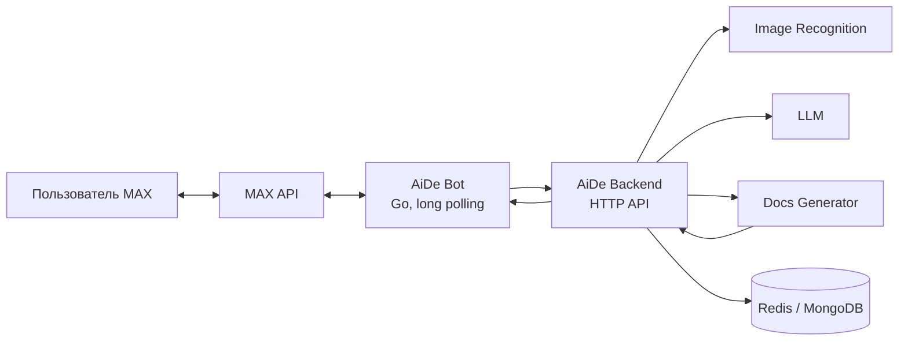

# AiDe Bot

AiDe Bot — бот для мессенджера MAX, который помогает готовить строительную и
сметную документацию. Сервис принимает текстовые сообщения и фотографии,
передаёт их в AiDe Backend, возвращает ответ пользователю и отправляет созданные
документы в чат.

## Назначение решения

Решение предоставляет пользователю единый интерфейс в MAX для консультаций и
подготовки документов. Бот отвечает за взаимодействие с мессенджером, проверку
входящих сообщений, загрузку изображений и доставку результата. Обработка текста,
OCR, работа LLM, хранение истории и генерация документов выполняются связанными
сервисами платформы AiDe.

## Основной пользовательский сценарий

1. Пользователь открывает AiDe Bot в MAX и отправляет `/start`.
2. Бот показывает главное меню.
3. Пользователь отправляет текстовый вопрос или одну фотографию JPEG/PNG с
   необязательной подписью.
4. Бот проверяет запрос и передаёт его в `POST /api/v1/process` AiDe Backend.
5. Backend обрабатывает запрос и возвращает текстовый ответ и, при необходимости,
   сведения о созданном документе.
6. Бот отправляет ответ и документ пользователю. Кнопка «Новый чат» очищает
   историю диалога через `POST /api/v1/clear-history`.

Ограничения входных данных: не более 2000 символов текста и не более одной
фотографии JPEG/PNG размером до 10 МиБ на сообщение. WebP от файлового сервера MAX
преобразуется в PNG; максимальное разрешение — 16 Мп.

## Состав и архитектура



Компоненты этого репозитория:

- `cmd/aide-bot` — точка входа приложения;
- `internal/apps/bot` — цикл long polling и пользовательские сценарии;
- `internal/services/maxapi` — клиент MAX API, меню, вложения и отправка файлов;
- `internal/services/backend` — JSON/multipart-клиент AiDe Backend;
- `internal/services/inputfilter` — нормализация и проверка входящих сообщений;
- `internal/core` — конфигурация и структурированное логирование.

Бот не предоставляет входящий HTTP API и не требует webhook: события он получает
через long polling MAX API. Контракт обязательных проверок backend описан в
[`DATA-API.yaml`](DATA-API.yaml).

## Запуск через Docker

Требуются Docker с Compose v2, доступ в интернет и токен бота MAX. Одна команда
собирает и запускает все локальные компоненты этого репозитория:

```bash
MAX_BOT_TOKEN='<тестовый-токен-MAX>' docker compose up --build
```

По умолчанию используется `BACKEND_STUB=true`: бот отвечает локальной заглушкой и
не требует запущенного backend. Для интеграционного запуска с production backend:

```bash
MAX_BOT_TOKEN='<тестовый-токен-MAX>' BACKEND_STUB=false BACKEND_API_BASE_URL='https://api-aide.icho.su' BACKEND_MESSAGES_PATH='/api/v1/process' BACKEND_CLEAR_HISTORY_PATH='/api/v1/clear-history' docker compose up --build
```

Для остановки контейнера выполните `docker compose down`.

## Параметры окружения

Перед запуском необходимо подготовить:

- токен тестового бота MAX;
- доступ к MAX API по HTTPS;
- для режима `BACKEND_STUB=false` — доступный AiDe Backend и пути его методов;
- Docker Engine с поддержкой Compose v2;
- для запуска без Docker — Go 1.24.

Секреты не должны попадать в Git. Для постоянной локальной конфигурации скопируйте
`.env.example` в `.env`, укажите токен и запускайте `docker compose up --build`.

## Переменные окружения

| Переменная | Обязательность | Значение по умолчанию | Назначение |
|---|---|---|---|
| `APP_NAME` | нет | `aide-bot` | Имя сервиса и значение заголовка `X-Client-Name` для backend. |
| `APP_ENV` | нет | `local` | Среда запуска: локальная, тестовая или production. |
| `LOG_LEVEL` | нет | `INFO` | Уровень структурированных логов. |
| `MAX_BOT_TOKEN` | да | — | Токен бота MAX. Не хранить в репозитории. |
| `MAX_API_BASE_URL` | нет | адрес SDK | Переопределение базового URL MAX API, например для тестового стенда. |
| `MAX_REQUEST_TIMEOUT` | нет | `45s` | Таймаут HTTP-запросов к MAX API и скачивания изображений. |
| `MAX_POLLING_PAUSE` | нет | `500ms` | Пауза между запросами long polling. |
| `MAX_POLLING_TIMEOUT` | нет | `30s` | Таймаут одного запроса long polling. |
| `BACKEND_STUB` | нет | `true` | `true` включает локальный ответ-заглушку; `false` включает HTTP-вызовы backend. |
| `BACKEND_API_BASE_URL` | при `BACKEND_STUB=false` | `http://localhost:8000` в Compose | Базовый URL AiDe Backend. |
| `BACKEND_MESSAGES_PATH` | при `BACKEND_STUB=false` | пусто | Путь обработки сообщений, обычно `/api/v1/process`. |
| `BACKEND_CLEAR_HISTORY_PATH` | для очистки истории | пусто | Путь очистки истории, обычно `/api/v1/clear-history`. |
| `BACKEND_REQUEST_TIMEOUT` | нет | `45s` в Compose, `10m` в приложении | Общий таймаут запроса к backend с учётом OCR и LLM. |

Значения времени поддерживают формат Go `time.Duration`: `500ms`, `45s`, `10m`.

## Используемые порты

Сам контейнер `aide-bot` не слушает TCP-порты и секция `ports` в
`docker-compose.yml` отсутствует.

| Направление | Порт | Назначение |
|---|---:|---|
| Исходящий | `443/tcp` | MAX API и публичный AiDe Backend по HTTPS. |
| Исходящий | `8000/tcp` | Локальный AiDe Backend при использовании адреса хоста/общей Docker-сети. |
| Исходящий | `80/tcp` | AiDe Backend внутри Kubernetes по адресу сервиса. |

При запуске backend на хосте нельзя использовать `localhost:8000` из контейнера:
укажите доступный контейнеру адрес хоста либо подключите сервисы к общей Docker-сети.

## Зависимости

Основные программные зависимости:

- Go `1.24`;
- `github.com/max-messenger/max-bot-api-client-go/v2 v2.0.0` — MAX Bot API;
- `golang.org/x/image v0.30.0` — декодирование WebP;
- Docker и Docker Compose v2 — контейнерный запуск;
- Alpine Linux и корневые сертификаты — runtime-образ.

Внешние сервисы в полном сценарии: MAX API, AiDe Backend, Image Recognition,
LLM-провайдер, Docs Generator, Redis и MongoDB. Бот напрямую обращается только к
MAX API и AiDe Backend.

## Тестовые данные API

Входящего API у самого бота нет. Следующие запросы проверяют backend-контракт,
который использует бот. Production URL: `https://api-aide.icho.su`.

Проверка доступности:

```bash
curl --fail-with-body --silent --show-error \
  'https://api-aide.icho.su/health'
```

Тестовое текстовое сообщение:

```bash
curl --fail-with-body --silent --show-error \
  --request POST \
  --header 'Content-Type: application/json' \
  --data '{
    "message_id": "readme-test-1",
    "text": "Кратко расскажи, чем ты можешь помочь при подготовке строительной документации.",
    "chat_id": -910002,
    "user_id": -910002
  }' \
  'https://api-aide.icho.su/api/v1/process'
```

Ожидаемый успешный ответ имеет HTTP-статус `200` и содержит поля `status`, `text`,
`file` и `error`:

```json
{
  "status": "ok",
  "text": "Ответ ассистента",
  "file": null,
  "error": ""
}
```

Тестовое сообщение с фотографией:

```bash
curl --fail-with-body --silent --show-error \
  --request POST \
  --form 'message_id=readme-photo-1' \
  --form 'chat_id=-910002' \
  --form 'user_id=-910002' \
  --form 'text=Используй данные с фотографии' \
  --form 'file=@./test-data/page.jpg;type=image/jpeg' \
  'https://api-aide.icho.su/api/v1/process'
```

Путь `./test-data/page.jpg` в примере нужно заменить путём к локальному JPEG или
PNG размером до 10 МиБ.

Очистка истории после теста:

```bash
curl --fail-with-body --silent --show-error \
  --request POST \
  --header 'Content-Type: application/json' \
  --data '{"conversation_id":"chat_-910002_user_-910002"}' \
  'https://api-aide.icho.su/api/v1/clear-history'
```

Ожидаемый статус очистки — `204 No Content`. Отрицательные тестовые идентификаторы
выбраны отдельно от обычных пользовательских данных.

## Локальный запуск без Docker

```bash
cp .env.example .env
go mod download
make run
```

## Проверки

```bash
make check
```

Команда запускает проверку форматирования, `go vet` и все Go-тесты.
